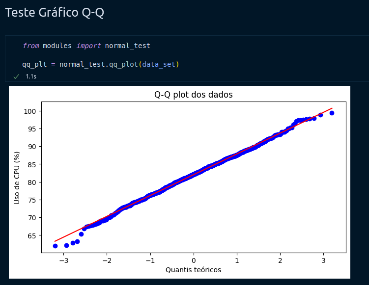

<p align="center">
  
</p>
<p align="center">UNIVERSIDADE FEDERAL DE PERNAMBUCO-UFPE</p>
<p align="center">CENTRO DE INFORMÁTICA</p>

##

<p align="center">
  
  
  
</p>

# Projeto: análise estatística de dados de CPU

## 📋 Sobre

Este projeto teve como objetivo investigar se o desempenho do processador Intel Core i5-10400 seria suficiente para executar o jogo Red Dead Redemption 2. Foram coletados dados de desempenho do CPU durante a execução do jogo e analisados estatisticamente utilizando bibliotecas Python. A normalidade dos dados foi atestada através do gráfico Q-Q e do valor-p, indicando que a base de dados é uma distribuição normal. Foi realizado um Teste Z para verificar se a média de desempenho do CPU seria considerada ideal, resultando na rejeição da hipótese nula. Portanto, concluiu-se que o processador Intel Core i5-10400 não foi eficiente para executar o jogo de interesse.

## 📂 Estrutura do projeto

```
project-statistics-and-probability-computing
├── README.md
├── Relatório Estatística.pdf
├── docs
|  ├── development_reference
|  |  └── git_work_flow.txt
|  └── project_material
|     ├── Especificação_projeto_2022.2.pdf
|     ├── data_set_group_0.txt
|     └── template_cisti_2014_pt.docx
├── requirements.txt
└── src
   ├── main.ipynb
   └── modules
      ├── Funcao_min_max.py
      ├── __init__.py
      ├── data.py
      ├── graphics.py
      ├── measure_centrality.py
      ├── normal_test.py
      └── setup.py

```

## 🚀 Rodando o projeto

1. Abra o notebook em <span>main.ipynb</span>
2. Execute o Jupyter Notebook
3. Acompanhe os resultados
   Espera-se:
   

## 🛠️ Tecnologias utilizadas

- Python 3
- Jupyter Notebook
- NumPy
- SciPy
- Matplotlib
- Seaborn

## ✒️ Autores

| [<br><sub>Douglas Araújo</sub>](https://github.com/thedouglasaraujo) | [<br><sub>Hallan Ângelo</sub>](https://github.com/hallanangelo) | [<br><sub>Hítalo Nascimento</sub>](https://github.com/HitaloNasc) | [<br><sub>Ingrid Freire</sub>](https://github.com/ingridfsl) | [<br><sub>Katharian Abrahel</sub>](https://github.com/katharianabrahel) | [<br><sub>Renata Santana</sub>](https://github.com/RenataAndradeSnatana) |
| :--------------------------------------------------------------------------------------------------------------------------------------------: | :----------------------------------------------------------------------------------------------------------------------------------------: | :-----------------------------------------------------------------------------------------------------------------------------------------: | :-------------------------------------------------------------------------------------------------------------------------------------: | :------------------------------------------------------------------------------------------------------------------------------------------------: | :------------------------------------------------------------------------------------------------------------------------------------------------: |
